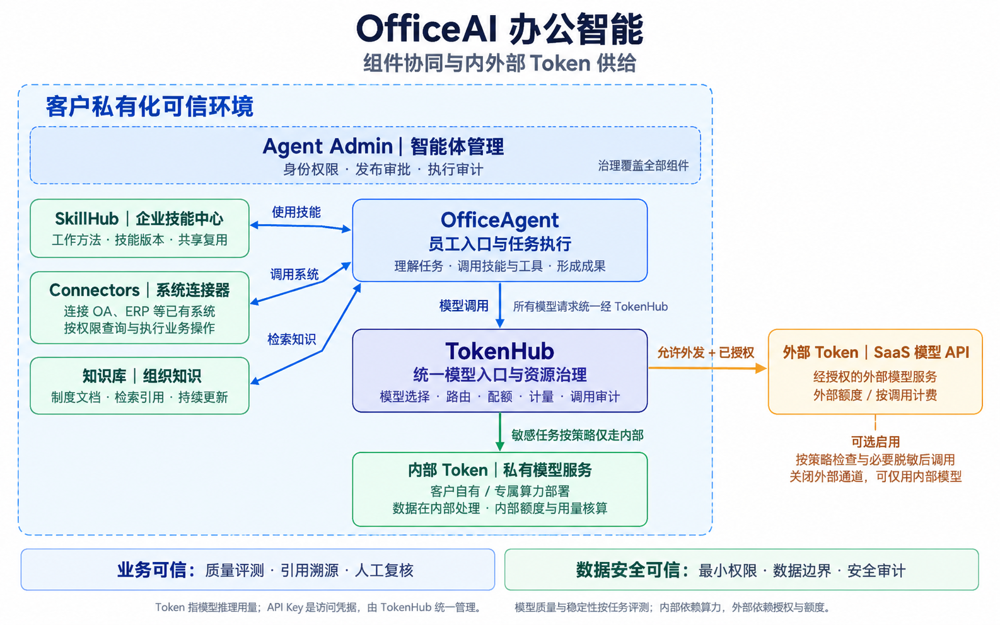

# OfficeAI 组件与内外部 Token 供给

日期：2026-09-29。用于业务方案沟通的建议架构图；具体配置和可交付能力以项目验证为准。



## 组件职责

- OfficeAgent：员工入口与任务执行，使用技能、调用授权工具和检索知识，模型调用统一经过 TokenHub。
- SkillHub：沉淀工作方法、管理技能版本、共享可复用技能。
- Agent Admin：身份权限、智能体发布审批与执行审计；治理覆盖各组件，不作为模型请求的串行处理节点。
- TokenHub：统一模型入口、模型选择、路由、配额、用量计量与模型调用审计。管理访问凭据，模型侧提供实际推理能力。
- Connectors：将已有系统的授权查询和业务操作开放给 Agent。
- 知识库：组织制度、文档及业务资料，提供有来源的检索依据并持续更新。

## 内外部 Token 依赖

- 内部 Token：由客户内部部署的模型服务产生，依赖客户自有或部署于客户边界内的专属算力、模型与运行资源；按内部额度管理和核算用量，不代表零成本。
- 外部 Token：由授权的 SaaS 模型 API 提供，依赖外部服务、网络可达性、调用授权、供应商额度及费用；是可选资源，不是 OfficeAI 软件的部署位置。
- 路由同时考虑任务质量与数据策略。敏感任务按策略只走内部；外发必须同时满足数据策略与调用授权，按需要执行脱敏。非敏感并不自动意味着允许外发。
- 可以关闭外部通道，仅使用内部模型。外部不可用时的任务处置应按项目配置，不默认把内部任务自动切换到外部。
- Token 是推理用量，API Key 是访问凭据；图中模型连接箭头表示请求方向，三个业务能力的双向连线表示调用与返回。
- 业务可信：质量评测、引用溯源、人工复核。数据安全可信：最小权限、数据边界与安全审计；审计内容及留存范围按数据策略确定。

## 生成与验收

- 使用内置 imagegen 工具生成，以用户提供的 metroAI / tokenHub 示意图作为风格参考。
- 已目视核验四个核心组件、连接器、知识库、私有化边界、内部模型与可选外部 API；无 OfficeAgent 绕过 TokenHub 的外部调用连线，双层可信及 Token / API Key 区分完整。
- 本轮仅交付图稿，未将建议架构自动写入官网或宣称为已实现的产品功能。

## 最终生成提示词

```text
Use case: infographic-diagram.
Create one polished, highly legible simplified-Chinese enterprise architecture diagram for OfficeAI, using the attached diagram ONLY as a visual style reference. This is a new diagram with different content. Landscape 2400x1500 or similar high resolution. White background, flat lightly tinted rounded rectangular boxes, fine blue/green/indigo/amber outlines, crisp dark Chinese sans-serif typography (PingFang/Source Han Sans style), no illustrations, no 3D, no decoration, plenty of whitespace. Clear directed orthogonal connectors; no intersecting text and lines, no ambiguous arrow ends. Large box titles and readable supporting text.

Title: "OfficeAI 办公智能"
Subtitle: "组件协同与内外部 Token 供给"
Main conceptual architecture, use exactly these meaningful relationships:
1. A large pale-blue dashed boundary covering roughly left 74% of the canvas labeled "客户私有化可信环境". ALL 4 core components OfficeAgent, SkillHub, Agent Admin, TokenHub AND Connectors AND 知识库 AND internal models are inside. External SaaS API must be clearly OUTSIDE on the right.
2. Across the top inside the boundary, a wide governance band:
"Agent Admin｜智能体管理"
"身份权限 · 发布审批 · 执行审计"
Small text: "治理覆盖全部组件". This is a management layer, not a step in the token call chain. Use dashed governance styling, no misleading serial arrow.
3. Center-upper primary blue node:
"OfficeAgent"
"员工入口与任务执行"
"理解任务 · 调用技能与工具 · 形成成果"
Three support nodes to its left, neatly vertically aligned:
"SkillHub｜企业技能中心"
"工作方法 · 技能版本 · 共享复用"
"Connectors｜系统连接器"
"连接 OA、ERP 等已有系统"
"按权限查询与执行业务操作"
"知识库｜组织知识"
"制度文档 · 检索引用 · 持续更新"
Arrows from OfficeAgent toward each corresponding support component labelled respectively "使用技能", "调用系统", "检索知识". Not a serial chain between these three. All three support OfficeAgent.
4. Below OfficeAgent a central prominent indigo node:
"TokenHub"
"统一模型入口与资源治理"
"模型选择 · 路由 · 配额 · 计量 · 调用审计"
Connect OfficeAgent DOWN to TokenHub with arrow labelled "模型调用".
Small annotation next to this model edge: "所有模型请求统一经 TokenHub".
5. Below TokenHub inside private boundary a green model-supply box:
"内部 Token｜私有模型服务"
"客户自有 / 专属算力部署"
"数据在内部处理 · 内部额度与用量核算"
Green directed connector from TokenHub to this internal box labelled "敏感任务按策略仅走内部".
6. Outside private boundary on the right, an amber model-supply box at same vertical level as TokenHub:
"外部 Token｜SaaS 模型 API"
"经授权的外部模型服务"
"外部额度 / 按调用计费"
Amber connector ONLY from TokenHub across private environment boundary to external box, labelled "允许外发 + 已授权". Include compact amber policy annotation below external box:
"可选启用"
"按策略检查与必要脱敏后调用"
"关闭外部通道，可仅用内部模型"
Important: this is an OPTIONAL model resource, not where OfficeAI software is deployed. Do not connect OfficeAgent directly to external box. Private deployment can optionally invoke external API; do not make blanket promise that any non-secret task automatically goes external.
7. At bottom, beneath main frame, a horizontal two-part trust summary:
"业务可信：质量评测 · 引用溯源 · 人工复核"
"数据安全可信：最小权限 · 数据边界 · 安全审计"
Small footer:
"Token 指模型推理用量；API Key 是访问凭据，由 TokenHub 统一管理。"
Second short footer:
"模型质量与稳定性按任务评测；内部依赖算力，外部依赖授权与额度。"

Layout should tell the story instantly: Employee workbench with skills/system connectors/knowledge, unified TokenHub, clear internal versus external model supply. Left side support components, center task execution/model gateway/internal model, right outside optional external model. Governance across top. Trust across bottom. Do not include metroAI branding or industrial business. No unsupported certification, no fake metrics. Precise Chinese text, visually aligned, professional diagram comparable to reference but richer and comprehensible.
```
